# Проект по изучению построения приложений на android с использованием Retrofit2 + Room + MVVM + Clean architecture

## Навигация

Описание лекции находится в ветках. Для прохождения определённой темы, нужно перейти на 
соответствующую.

### Тема 6 - UI

Осталось сделать самое простое, но самое главное - слой ui - слой с которым взаимодействует 
пользователь.

Пользователь взаимодействует с элементами экрана, а эти элементы экрана уже вызывают функции, 
которые мы написали до этого.

Первое, что нам необходимо сделать - сверстать макет, который потом мы будем показывать пользователю

Допустим, у нас будет список с записями, они будут подгружаться при старте прилождения и кнопка,
после нажатия на которую, будет показываться форма для создания новой записи.
При этом, при нажатии на каждую запись будет выводиться макет деталей одной записи.

Начнём со списка:

Можно верстать непосредственно в активити, но современный подход - Single activity - в активити не 
пишется код, весь код создаётся через Fragment и они уже в свою очередь вставляются в компонент activity

При создании фрагмента, можно выбрать сразу list fragment - фрагмент со списком.
При этом будут созданы:
- макет экрана
- макет элемента списка
- исходный код фрагмента
- исходный код адаптера списка

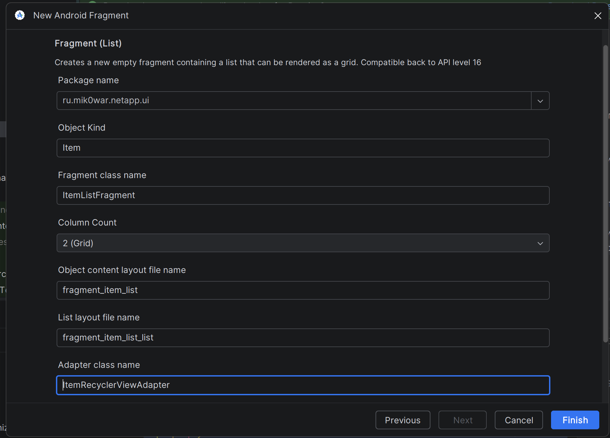

Сразу после создания, изменим под наш проект макет одного элемента списка: добавим отступов и т.п.

В случае необходимости, можно в папке drawable создать необходимый векторный ассет - иконку, которую 
можно использовать в вёрстке

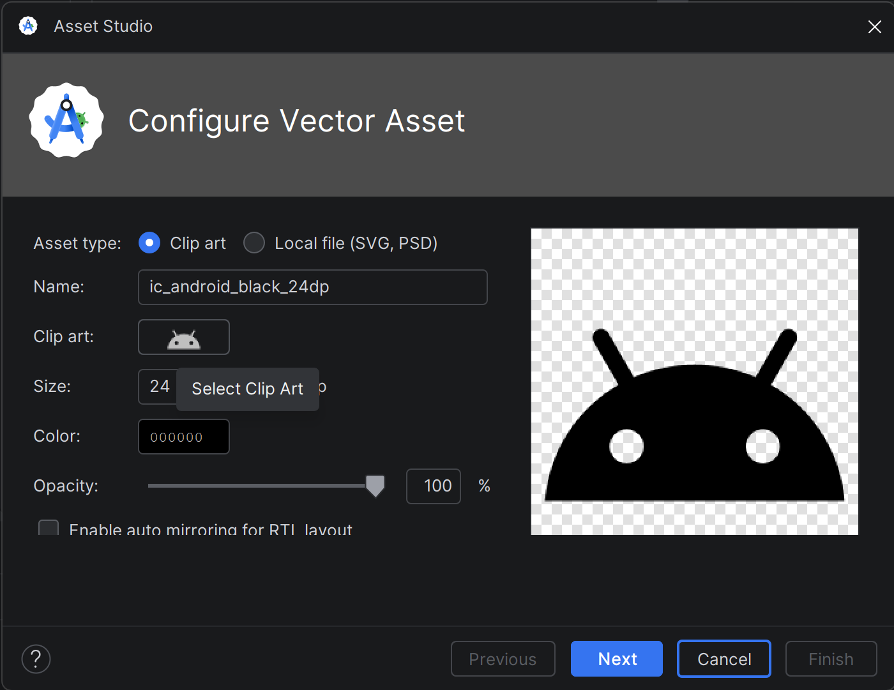

Обратите внимание на то, чтобы элемент списка не занимал всё свободное пространство экрана!

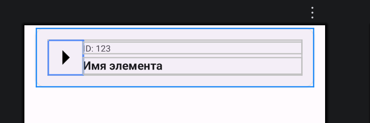

Этот же элемент можно использовать для отображения ошибки (при этом, скрываются все элементы, 
которые показывают контент в случае успеха)

Далее, перейдём к вёрстке макета основного экрана. Автоматом создаётся просто экран со списком. 
Нам нужна кнопка, при нажатии на которую будет создаваться новый элемент.

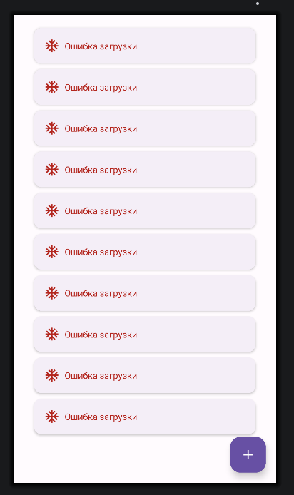

По нажатию на эту кнопку должна открываться какая-то форма для ввода данных. 
В данном случае можно реализовать форму в виде диалогового окна. 
Его отличие от других элементов - диалог открывается не на весь экран, 
занимает только часть экрана и нажатие на область вне диалога приводит к его закрытию. 
Для этого экрана в любом случае необходимо создать дополнительный макет

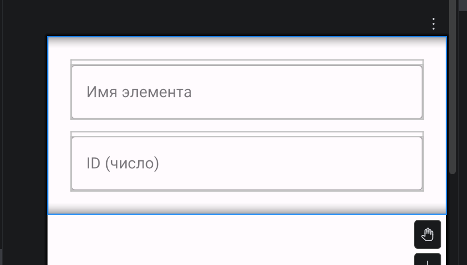

После того, как доделали макеты, перейдём к написанию кода.
Первым делом, необходимо настроить ViewModel. ViewModel - класс, который предоставляет интерфейс 
для взаимодействия с модулями, написанными нами ранее. 
В современных версиях sdk используется встроенный класс ViewModel, от которого наследуются конкретные 
реализации этого механизма. Необходимо это для корректной обработки смерти процесса 
(например, чтобы данные не исчезали при смене ориентации экрана и т.п.)

ViewModel создаётся в ui слое как один из классов.

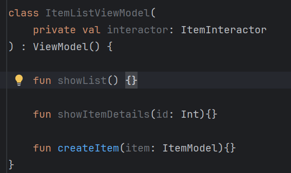

Первая задача ViewModel'и - запустить корутину. Для этого необходимо добавить зависимость в build.gradle

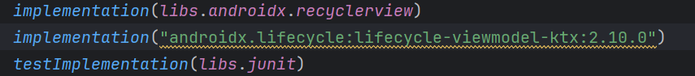

После каждого добавления зависимостей не забывайте обновлять build.gradle!

Теперь мы можем при вызове каждой из функций создавать корутину. Внутри каждой функции необходимо вызывать
соответствующий метод из interactor'а и обрабатывать результат.

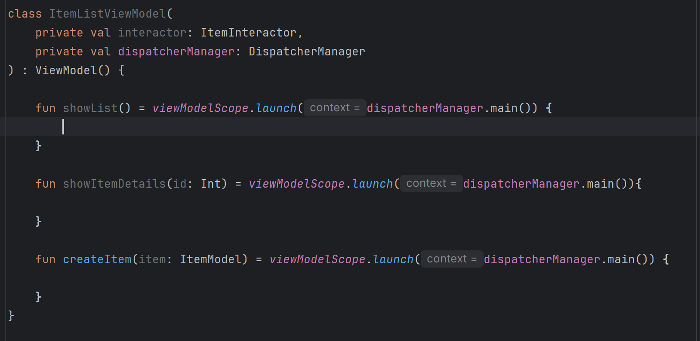

Для обработки результата, полученного из domain слоя чаще всего используется класс LiveData - 
Механизм обновляемых данных

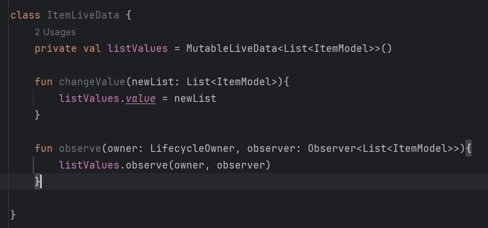

В данном контексте метод changeValue вызывается для смены хранимого значения, 
метод observe вызывается для добавления обработчика изменения хранимого значения. 
После его вызова, метод который был передан в качестве аргумента в эту функцию 
будет отрабатывать каждый раз при изменении значения.

Теперь перейдём к написанию класса адаптера списка. 
Адаптер - класс, который нужен для работы списка. Пишется довольно однотипно, но иногда бывают отличия.

Для адаптера необходимо написать класс ViewHolder, а в нём связать макет элемента списка с моделью данных.
Чтобы это сделать и последовать всем требованиям инкапсуляции, необходимо создать свою модель для UI слоя - 
таким образом мы не нарушим независимость слоёв и всё правильно будет организовано

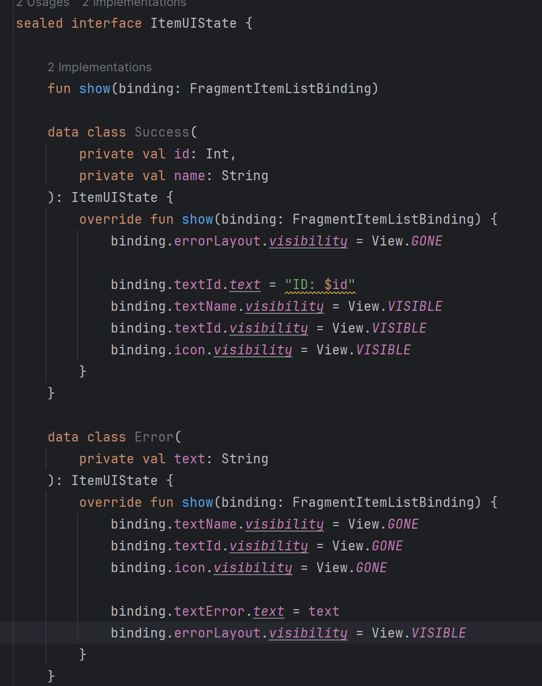

При этом, теперь все классы этого слоя должны быть завязаны именно на эту модель данных

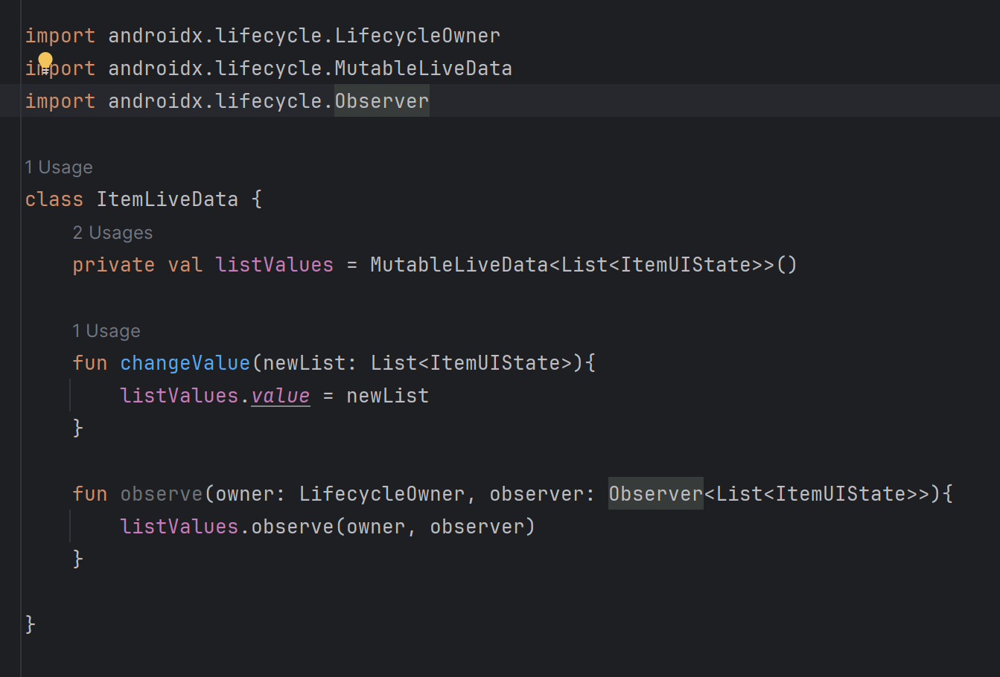

Теперь, чтобы корректно отображать элементы в списке, необходимо пробросить маппер в зависимость вьюмодели

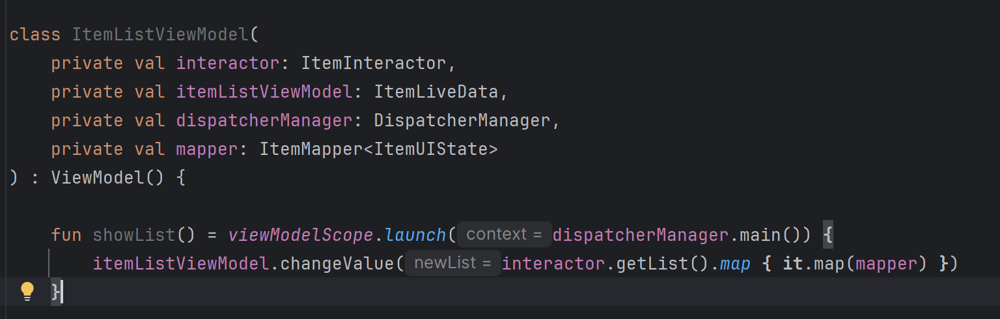

Вернёмся к написанию класса адаптера. В такой архитектуре необходимо только вызвать метод show в классе биндера и 
всё сработает корректно.

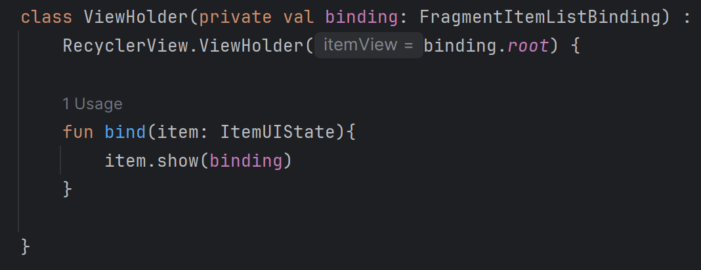

Воспользуемся стандартными классами: DiffUtilsCallBack

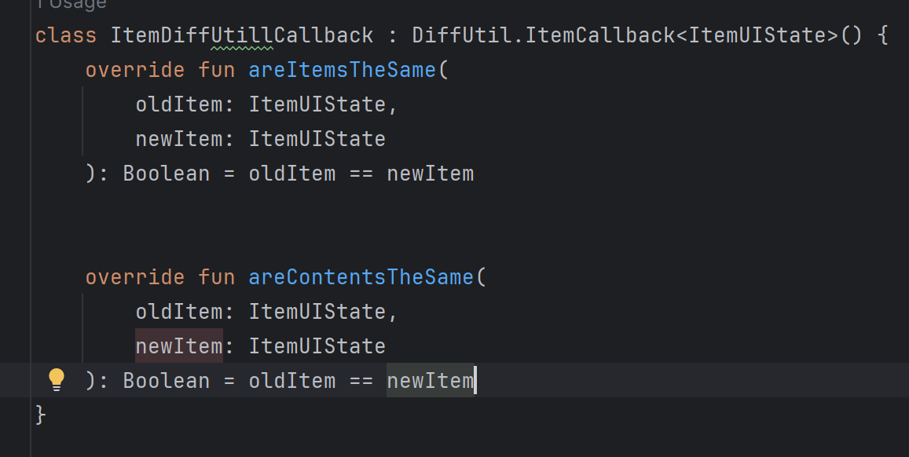

И ListAdapter

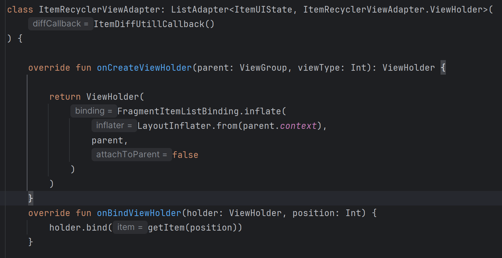

Для проверки работы нашего списка, необходимо настроить отображение фрагмента в активити

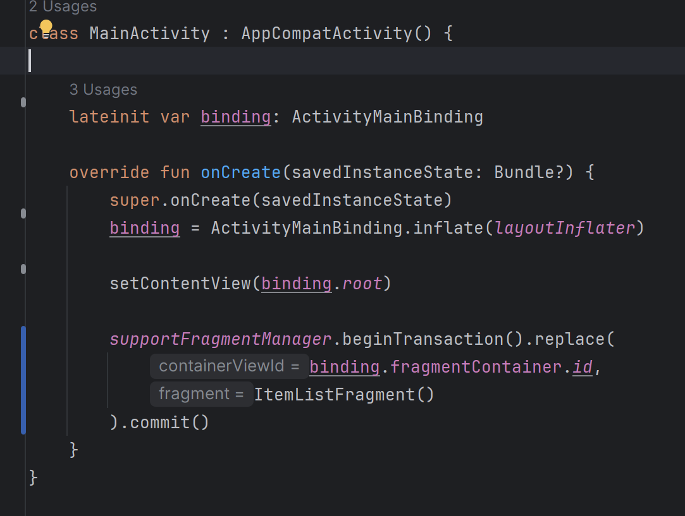

Во фрагменте надо получить ViewModel (для этого написан класс ViewModelProvider) 
и настроить адаптер

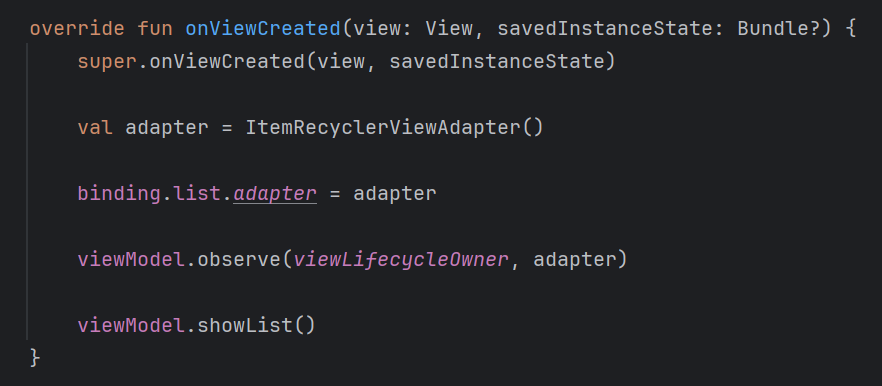

Обратите внимание, часть кода было отрефакторено, чтобы соблюсти все принципы ООП.
Последняя рабочая версия кода представлена именно в ветке, не на скринах!

Аналогично описанному бизнес-процессу можно реализовать и оставшиеся функции

В результате, в случае ошибки показывается причина ошибки:
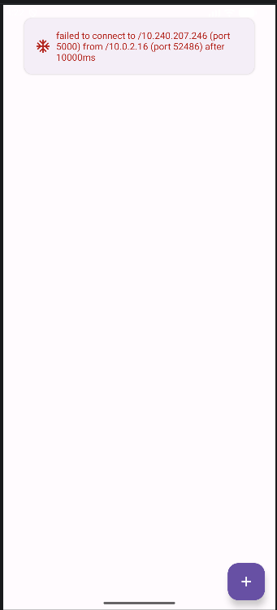

А в положительном случае, показывается список из сервера

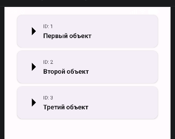
