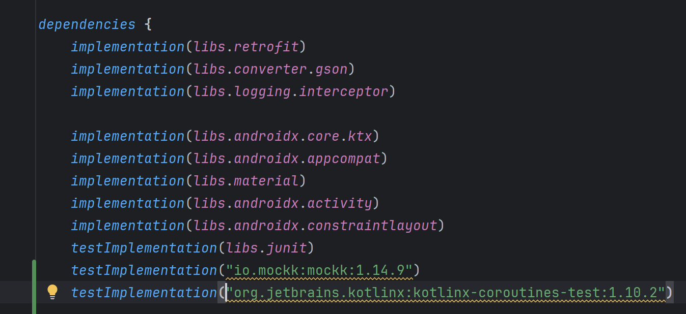
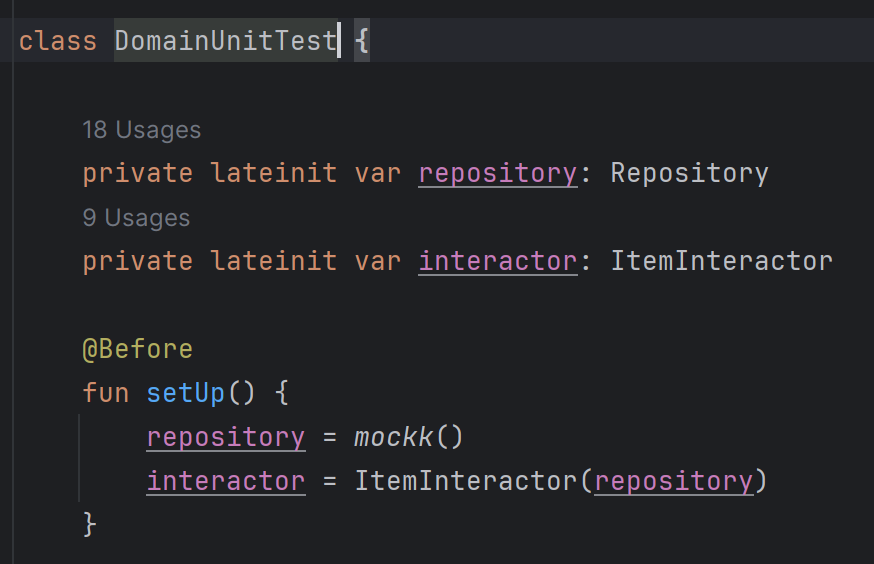
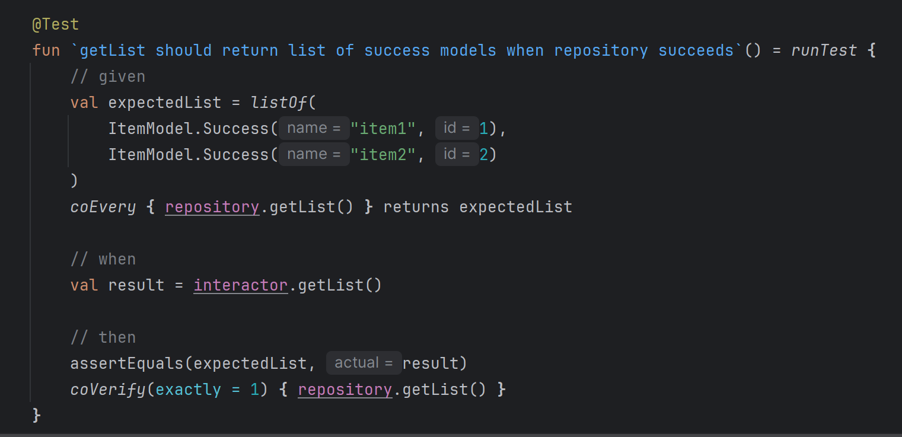
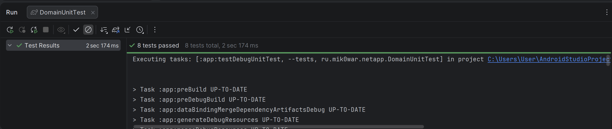

# Проект по изучению построения приложений на android с использованием Retrofit2 + Room + MVVM + Clean architecture

## Навигация

Описание лекции находится в ветках. Для прохождения определённой темы, нужно перейти на 
соответствующую.

### Тема 4 - Domain

После полноценного подключения библиотеки Retrofit, пришло время полноценно прописать слой бизнес-логики.
На самом деле, разработка приложения начинается именно с этого - с построения основных процессов, 
которые не зависят но от библиотек, ни от андроида.

В данном приложении нами будет реализовано 3 функции:
- получение списка объектов;
- получение детализации по одному из объектов;
- создание нового объекта.

Первый момент: нам необходимо определить модель данных, которая будет использоваться во всём проекте.
Казалось бы, мы уже создали модель ServerDTO, которую можно использовать и дальше, но этого подхода
лучше не придерживаться. Модель ServerDTO - модель, сделанная специально для библиотеки retrofit2. 
В случае, если завтра вам понадобится подменить библиотеку на какую-то другую, придётся очень многое менять
(на такие объекты обычно завязано много логики). Более предпочтительно вводить для своего использования
свою локальную модель данных (даже если она повторяет поля в модельках из библиотек) - таким образом
достигается независимость компонентов.

Определяем свою модель данных в слое domain - класс, который будет хранить необходимую для нас информацию

Теперь можно перейти к написанию бизнес-логики. Для выполнения поставленных функций, 
нам понадобится обращаться к слою модели. Этот слой должен предоставлять возможность 
остальной части приложения получать и сохранять данные.
Типичный паттерн проектирования, который используется при написании этого слоя - Repository.

Repository - это класс, который инкапсулирует в себя всю логику работы с источниками данных - DataSources.
При этом, для обеспечения максимальной независимости слоя бизнес-логики от слоя данных,
необходимо создать интерфейс репозитория в слое домена, а его реализацию в слое данных.
Такой подход "меняет" зависимость - слой домена не зависит от слоя модели,
а слой модели сделан под конкретный слой домена.

Для выполнения функций напишем интерфейс репозитория - методы, которые надо вызывать как один из шагов бизнес-процесса.

Последнее, что нам осталось реализовать - класс интерактор.

Класс ItemInteractor - класс, в котором реализована вся бизнес-логика. 
В данном случае нас интересует следующая последовательность шагов: 
- отправить запрос;
- получить ответ;
- обработать ошибки;
- передать данные в место вызова.

В случае отправки сетевых запросов может возникнуть большое количество ошибок - от отсутствия 
интернета, до клиентских ошибок 400 при неправильно введённых данных.
Фактически, в случае возникновения ошибки, нам необходимо сообщить об этом пользователю - 
вывести отдельную картинку или текст с уведомлением пользователя о том, из-за чего возникла ошибка
Существует много способов обрабатывать ошибки, мы воспользуемся следующим подходом: 
Изменим модель данных так, чтобы один из её наследников реализовывал результат успешного запроса, 
а второй - ошибку

Sealed interface в данном случае - интерфейс, наследоваться от которого можно только в рамках 
текущего пакета.

Теперь, наконец, мы можем реализовать класс с основными функциями. Здесь, в качестве параметра класса
приходит объект репозитория - именно интерфейса, в функциях getList и getItem результат выполнения 
функций - либо модель успешного запроса, либо модель ошибки. Функция createItem в случае успешного 
выполнения просто возвращает true, в случае ошибки - возвращает false

## Как проверить, правильно ли был написан код

Вот мы написали код, но этого кода ещё не достаточно, чтобы его запускать. Хочется иметь возможность 
протестировать отдельно текущий модуль domain и его классы.
Чтобы это сделать можно написать модульные тесты.
Модульные тесты пишутся в папках, выделенных зелёным цветом в среде - unit тесты пишутся в папке (test)

Всегда в проекте есть ExampleUnitTest - этот класс нужен для проверки того, что модуль тестов 
установлен правильно 

Создадим свой класс - DomainUnitTest и будем в нём тестировать функции ItemInteractor. Задача юнит тестов - 
проверить только текущий модуль на всех возможных комбинациях входных значений.

Во-первых, в тестируемых функциях используются корутины - это значит, 
что каждый тест должен запускать корутину. Для этого нужна отдельная зависимость
Во-вторых, в текущий класс приходит зависимость. Можно либо самому написать подмену, либо воспользоваться 
библиотекой mockk

До тестов будет вызван метод, аннотированный @Before, в котором будут созданы нужные классы

Разберём конкретный тест:

В любом тесте можно выделить три блока:
- given - заранее известные выходные значения
- when - вызов проверяемой функции
- then - сравнение полученных результатов с ожидаемыми

В самом конце, можно через класс запустить все тесты на слой и увидеть, что код выполняется корректно

