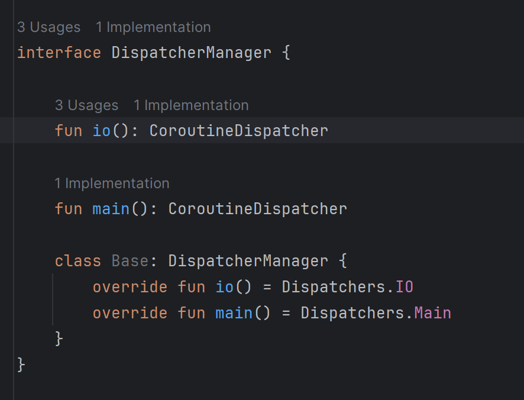
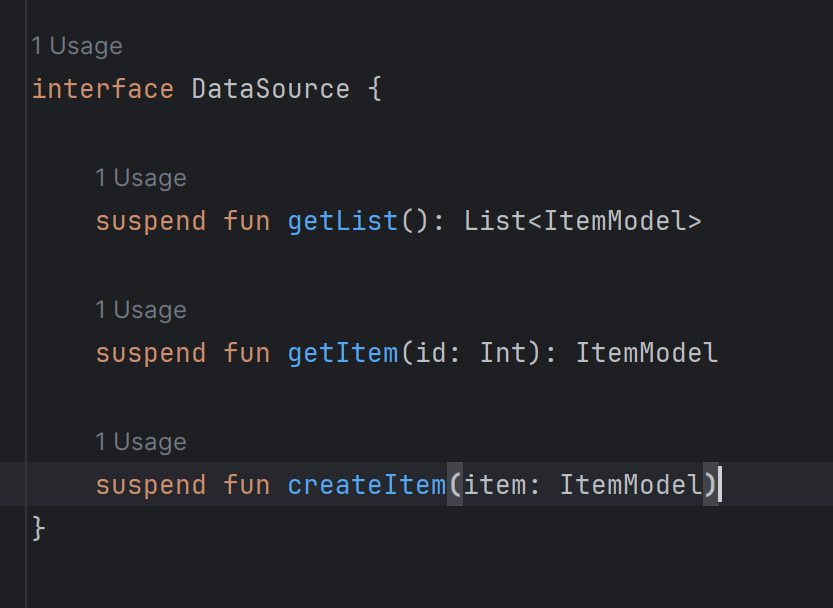
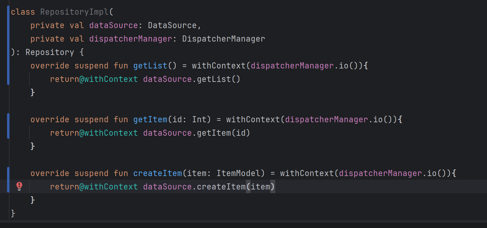
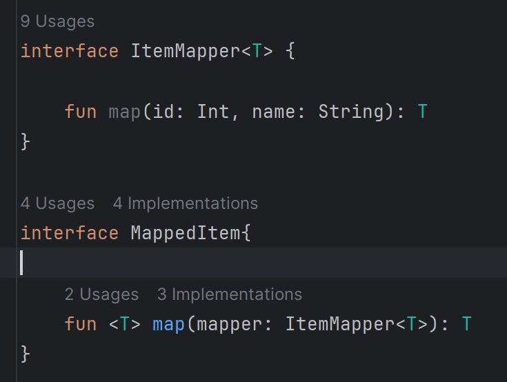
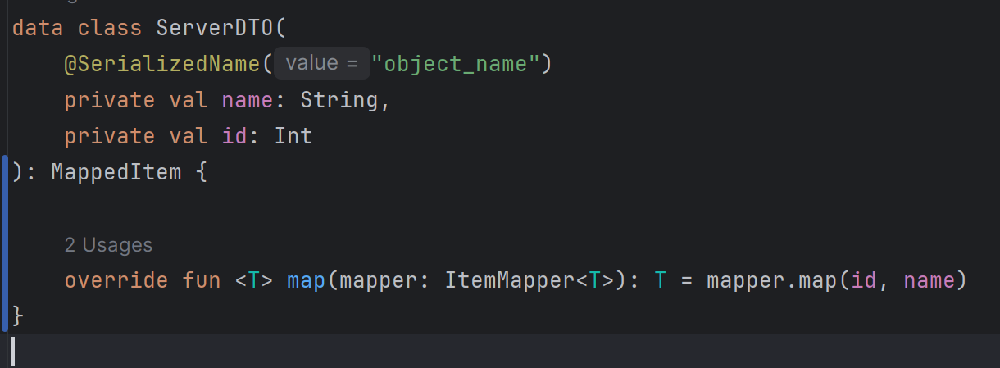
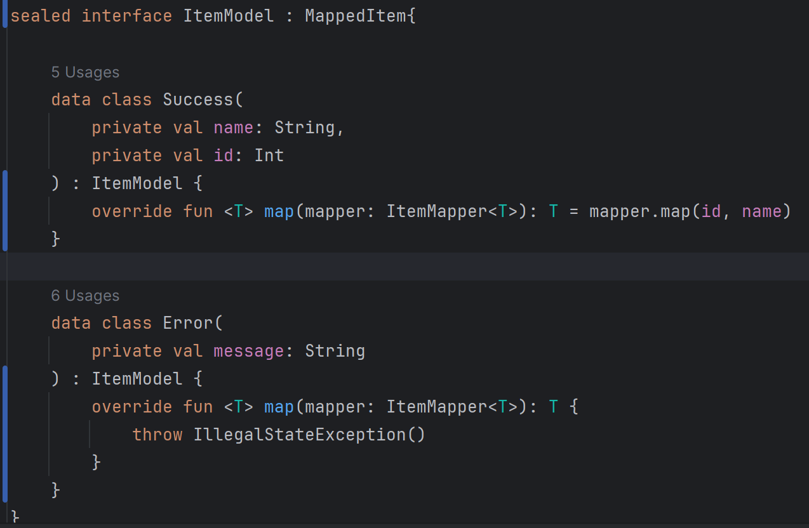
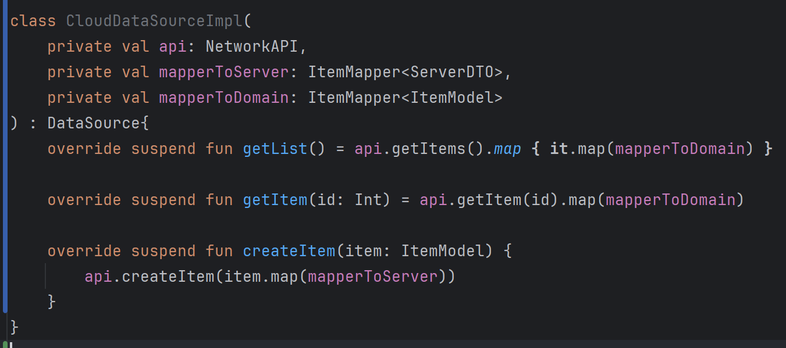
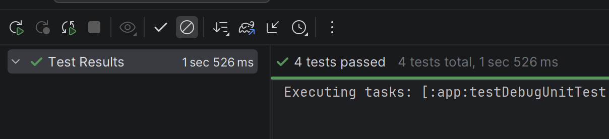

# Проект по изучению построения приложений на android с использованием Retrofit2 + Room + MVVM + Clean architecture

## Навигация

Описание лекции находится в ветках. Для прохождения определённой темы, нужно перейти на 
соответствующую.

### Тема 5 - Data

Наконец, перейдём к слою работы с данными. У нас уже есть подключённый Retrofit2 и интерфейс репозитория.
Осталось написать класс, который будет наследовать интерфейс репозитория и реализовывать логику обращения на сервер.
При проектировании программ рекомендуется максимально абстрагироваться от конкретных библиотек, 
поэтому можно создать для работы с сервером интерфейс DataSource и 
репозиторий делать зависимым от него, а не от библиотеки

Задача репозитория - обратиться к источнику данных. Такое обращение возможно на потоке IO - для этого 
надо вызвать функцию withContext. DispatcherManager - класс, который нужен для облегчения последующего тестирования

Помимо того, что этот уровень позволит избавиться от зависимости от библиотек, этот уровень позволит 
преобразовать ServerDTO в нашу модель данных. 
Хороший подход - оставлять все поля приватными, но каким же образом нам преобразовать 
данные из одной модели в другую? Нам нужен класс маппера, который преобразует 
модель из одного вида в другой

Теперь, нам нужно построить сам источник данных - он как зависимость получает api и 
обращается к нему, преобразуя перед этим объекты так, как необходимо - для этого надо дописать методы в 
модели данных, которые мы будем преобразовывать

Сам источник данных:

## Тесты

У нас происходит много процессов, поэтому тесты на этот слой надо написать обязательно. 

Обычно надо стараться писать тесты на каждый класс отдельно, чтобы проверить работу каждого 
конкретного класса. Чем больше линий кода будет протестировано на уровне модульного тестирования, 
тем больше вероятность того, что приложение будет работать корректно

